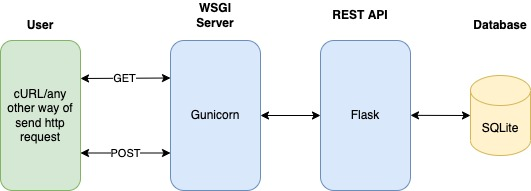

The design is shown in the picture



if there's no `test.db` file, run the script to create database file:
```python
python db.py
```

start server, this command start servers with number of workers equal to number of cores
```python
gunicorn -c gunicorn.conf.py deploy:app
```

get data by curl:
```python
curl -X GET "http://0.0.0.0:6000/query"
```

add data item by curl:
```python
curl --location --request POST '0.0.0.0:6000/add' \
--header 'Content-Type: application/json' \
--data-raw '{"FACTORY_ID": 12, "ORG_ID": 445, "COUNTRY": "VN", "EXECUTION_DATE": "2022-08-05","FAIL_RATE": 0.2}'
```

pylint code check:
    deploy.py       8.1/10
    db.py           8.57/10
    test_request.py 7.14/10

run cve check
```bash
cve-bin-tool ./
```